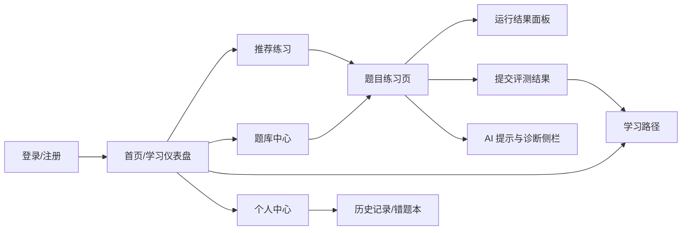
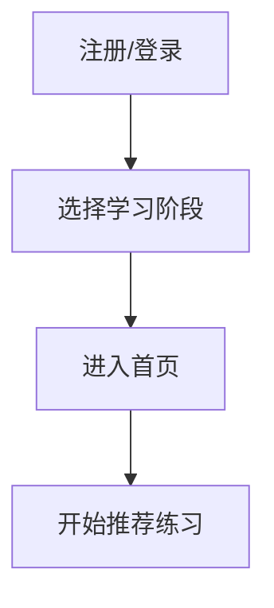
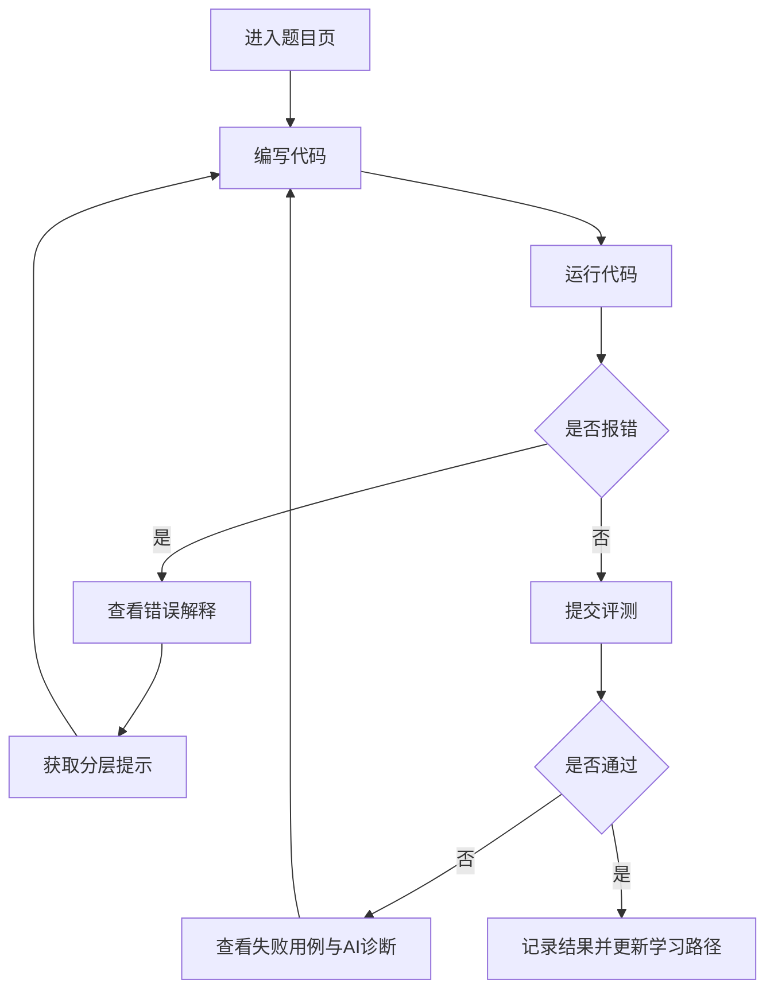
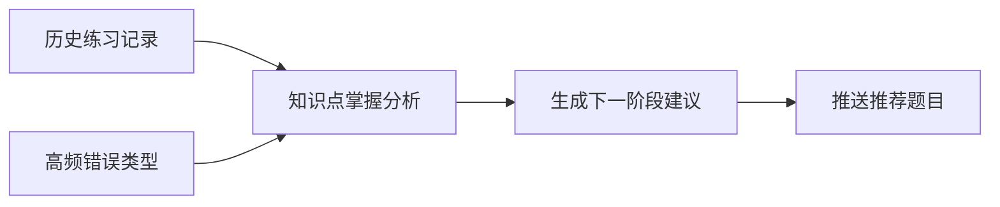
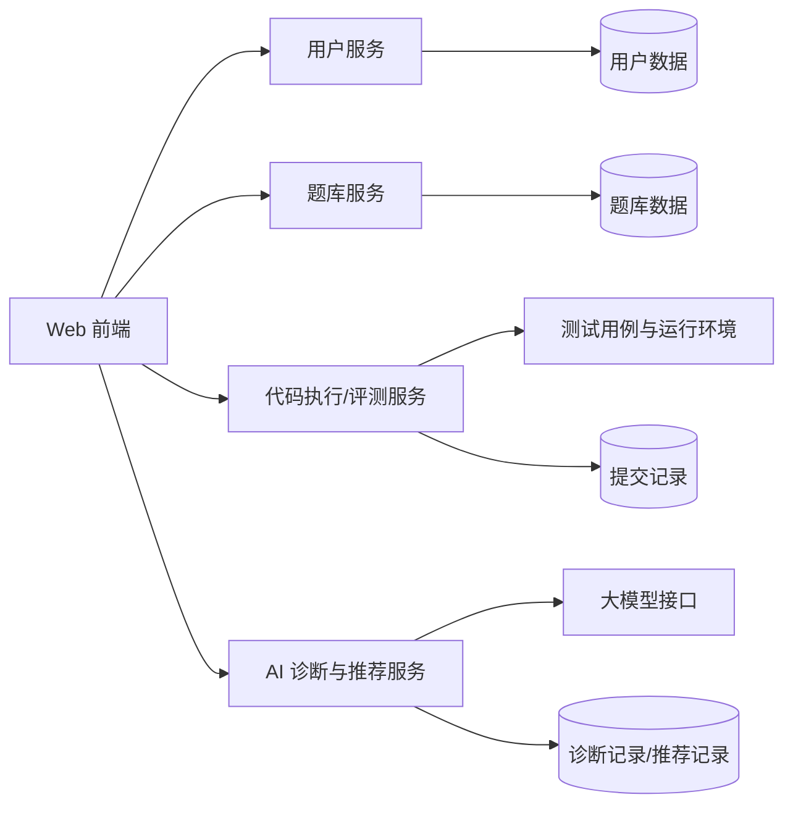

# AI 驱动的编程练习助手功能草图

## 1. 草图目标

本草图用于把《需求分析说明书》中的核心需求转化为可讨论的产品结构与页面轮廓，帮助团队在概要设计前统一对系统入口、核心流程、页面职责和模块关系的理解。

## 2. 产品结构草图



## 3. 导航信息架构

### 3.1 一级导航

1. 首页
2. 练习题库
3. 学习路径
4. 个人中心

### 3.2 页面职责

| 页面 | 页面职责 |
| --- | --- |
| 首页 | 展示学习概况、推荐题、最近进度、继续练习入口 |
| 练习题库 | 浏览与筛选题目，按知识点/难度进入练习 |
| 题目练习页 | 查看题目、编写代码、运行、提交、查看 AI 诊断 |
| 学习路径 | 查看当前阶段、薄弱点、推荐学习顺序 |
| 个人中心 | 历史提交、错题统计、能力画像 |

## 4. 核心页面低保真草图

### 4.1 首页/学习仪表盘

```text
+----------------------------------------------------------------------------------+
| Logo                  首页   练习题库   学习路径   个人中心            [用户头像] |
+----------------------------------------------------------------------------------+
| 你好，今天继续练习 Python                                                         |
| 目标：完成 2 道基础题，重点巩固 循环 / 列表                                       |
+--------------------------------------+-------------------------------------------+
| 今日推荐                              | 学习概览                                  |
| 1. 猜数字（基础）                     | 已完成题目：18                            |
| 2. 列表去重（基础）                   | 最近通过率：72%                           |
| 3. 统计字符串字符（进阶）             | 高频错误：IndexError / 缩进错误           |
| [开始推荐练习]                        | [查看学习路径]                            |
+--------------------------------------+-------------------------------------------+
| 继续上次练习                                                                      |
| 题目：判断闰年                         上次状态：测试未通过 2/6                   |
| [继续编码]                                                                     |
+----------------------------------------------------------------------------------+
| 薄弱点强化                                                                       |
| 条件判断 | 循环控制 | 列表索引 | 函数参数                                       |
+----------------------------------------------------------------------------------+
```

设计意图：

1. 首屏直接进入学习状态，不做营销型首页。
2. 推荐题、继续练习、学习概览同时出现，降低用户决策成本。
3. 对初学者最重要的信息不是“功能介绍”，而是“现在该做什么”。

### 4.2 练习题库页

```text
+----------------------------------------------------------------------------------+
| 搜索题目 [____________________]   知识点 [列表v] 难度 [基础v] 状态 [全部v]      |
+-----------------------------+----------------------------------------------------+
| 分类导航                    | 题目列表                                           |
| - 基础语法                  | [基础] 判断奇偶        通过率 85%   状态：未做     |
| - 条件判断                  | [基础] 成绩分级        通过率 78%   状态：已做     |
| - 循环                      | [基础] 打印乘法表      通过率 64%   状态：未做     |
| - 列表与字符串              | [进阶] 列表去重        通过率 51%   状态：错题     |
| - 函数                      | [进阶] 统计单词频次    通过率 43%   状态：推荐     |
| - 异常处理                  |                                                    |
+-----------------------------+----------------------------------------------------+
```

设计意图：

1. 题库支持按知识点和难度快速筛选。
2. 列表中展示“通过率/状态”，帮助初学者判断题目是否合适。
3. 错题和推荐题应在列表中有明显标记。

### 4.3 题目练习页

```text
+----------------------------------------------------------------------------------+
| 题目：列表去重                                                    难度：基础进阶  |
| 标签：列表 / 循环 / 条件判断                                                      |
+-------------------------------------+--------------------------------------------+
| 题目描述                            | AI 助手                                    |
| - 输入一个列表                      | 你可以这样提问：                           |
| - 输出去重后的结果                  | 1. 解释报错                                |
| - 保持原顺序                        | 2. 给我第一层提示                          |
| 示例：...                           | 3. 这一题要用什么思路                      |
|                                     |--------------------------------------------|
|                                     | [错误解释] [思路提示] [知识点]             |
|                                     |                                            |
|                                     | 诊断结果会显示在这里                       |
+-------------------------------------+--------------------------------------------+
| 代码编辑器                                                                       |
| def remove_dup(items):                                                          |
|     ...                                                                         |
|                                                                                 |
+----------------------------------------------------------------------------------+
| [运行代码] [提交评测] [获取提示]                                 运行状态：未提交 |
+-------------------------------------+--------------------------------------------+
| 输出 / 报错                         | 测试结果                                    |
| Traceback...                        | 通过 3/6                                    |
| TypeError: ...                      | 失败点：重复元素处理                        |
+-------------------------------------+--------------------------------------------+
```

设计意图：

1. 题目、代码、反馈、AI 侧栏同屏协作，避免用户来回切页。
2. AI 助手固定围绕当前题目上下文工作，减少泛聊。
3. 运行与提交分离，符合初学者“先试、再测”的习惯。

### 4.4 AI 诊断弹层/侧栏展开态

```text
+----------------------------------------------------------------------------------+
| 错误类型：TypeError                                                              |
| 错误解释：你正在把一个不能直接拼接的值和字符串放在一起。                         |
| 可能原因：                                                                       |
| 1. print("结果是" + num) 中 num 是整数                                           |
| 2. 列表或 None 被当成字符串拼接                                                  |
| 建议排查步骤：                                                                   |
| 1. 先定位报错行                                                                  |
| 2. 查看参与运算的数据类型                                                        |
| 3. 必要时使用 str() 转换                                                         |
| 相关知识点：类型转换、print 输出、字符串拼接                                     |
|----------------------------------------------------------------------------------|
| 提示等级                                                                         |
| [一级：只给思路] [二级：定位问题] [三级：关键代码建议]                           |
+----------------------------------------------------------------------------------+
```

设计意图：

1. 解释必须说人话，先讲“发生了什么”，再讲“为什么”。
2. 诊断结构固定，增强一致性与可信度。
3. 通过提示分级控制 AI 过度剧透。

### 4.5 学习路径页

```text
+----------------------------------------------------------------------------------+
| 你的当前阶段：Python 基础巩固                                                    |
| 最近判断：循环和列表已入门，函数参数与异常处理较弱                               |
+--------------------------------------+-------------------------------------------+
| 推荐学习顺序                          | 薄弱点分析                                  |
| 1. 函数参数传递                       | 高频错误：                                  |
| 2. 返回值与作用域                     | - IndexError                                |
| 3. 异常处理基础                       | - TypeError                                 |
| 4. 综合练习                           | - 未正确处理空列表                           |
| [开始下一阶段]                        | [去做针对练习]                              |
+--------------------------------------+-------------------------------------------+
| 最近 7 次练习趋势                                                               |
| 通过率： 40% -> 55% -> 71%                                                     |
+----------------------------------------------------------------------------------+
```

设计意图：

1. 把“下一步学什么”可视化，减少学习迷茫。
2. 路径建议要与错误画像联动，而不是静态推荐。

### 4.6 个人中心/历史记录

```text
+----------------------------------------------------------------------------------+
| 用户：张三                         学习阶段：基础巩固                             |
+--------------------------------------+-------------------------------------------+
| 统计卡片                              | 最近提交记录                                |
| 累计做题：18                          | 列表去重        未通过   2026-06-05         |
| 通过题目：11                          | 判断闰年        已通过   2026-06-05         |
| 平均通过率：68%                       | 打印乘法表      已通过   2026-06-04         |
| AI 提示使用次数：23                   | 猜数字          未通过   2026-06-04         |
+--------------------------------------+-------------------------------------------+
| 错题本                                                                            |
| [列表去重] [统计字符串字符] [斐波那契数列]                                        |
+----------------------------------------------------------------------------------+
```

## 5. 关键交互流程草图

### 5.1 首次使用流程



### 5.2 做题与诊断流程



### 5.3 路径推荐流程



## 6. 功能优先级草图

| 优先级 | 功能 |
| --- | --- |
| P0 | 登录、首页推荐、题库、题目页、代码运行、提交评测 |
| P0 | AI 错误诊断、分层提示 |
| P1 | 学习路径、个人成长看板、错题本 |
| P2 | 教师后台、题目管理增强、排行榜/打卡 |

## 7. 前后端模块映射草图



## 8. 草图结论

首期产品最重要的是跑通一条完整链路：

1. 用户进入首页
2. 获得推荐题
3. 在线练习并提交
4. 在报错和失败时得到 AI 引导
5. 练习结束后看到成长反馈与下一步建议

因此，页面设计必须服务于“低门槛开始练习”和“高效率解决卡点”两件事。后续概要设计应以本草图为基础，继续细化模块接口、数据库结构、AI 提示策略和测试用例。
