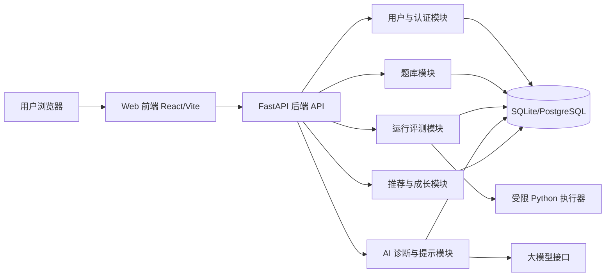
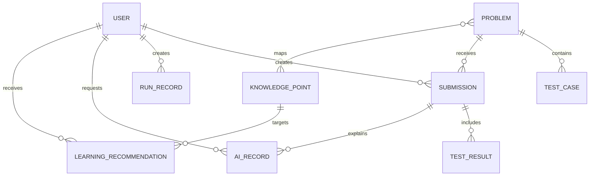
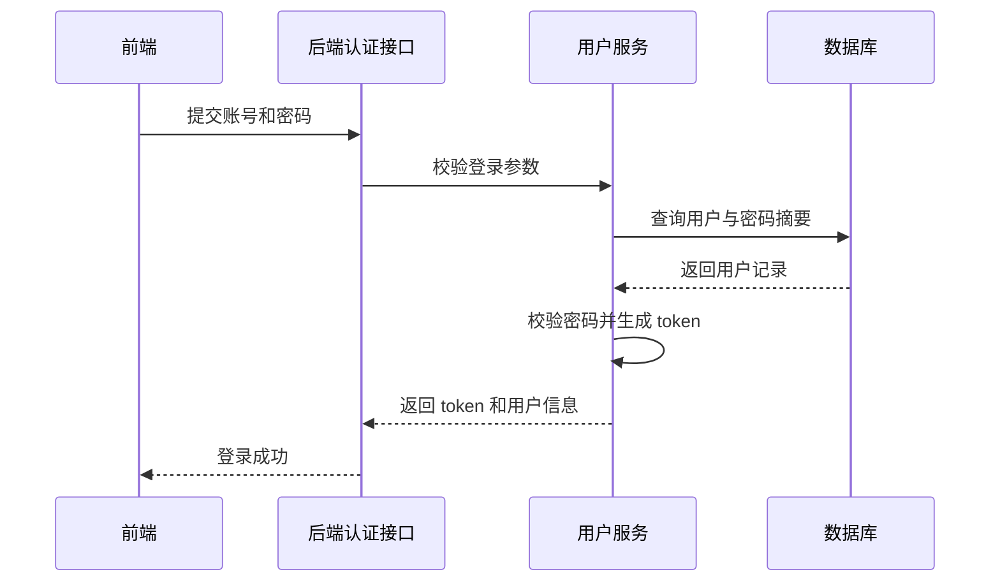
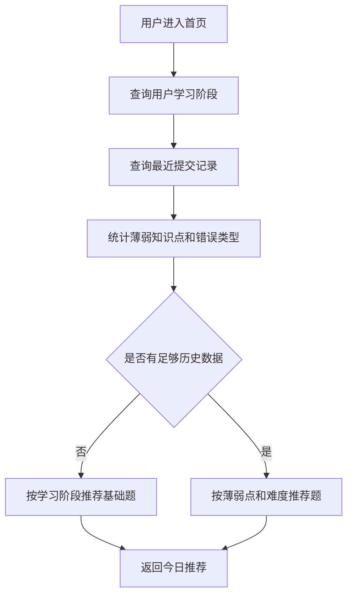
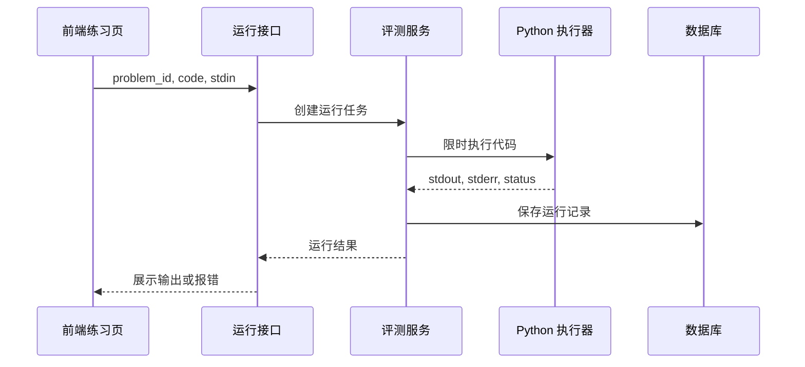
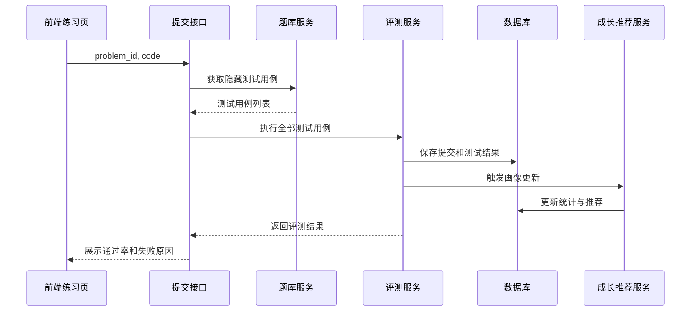
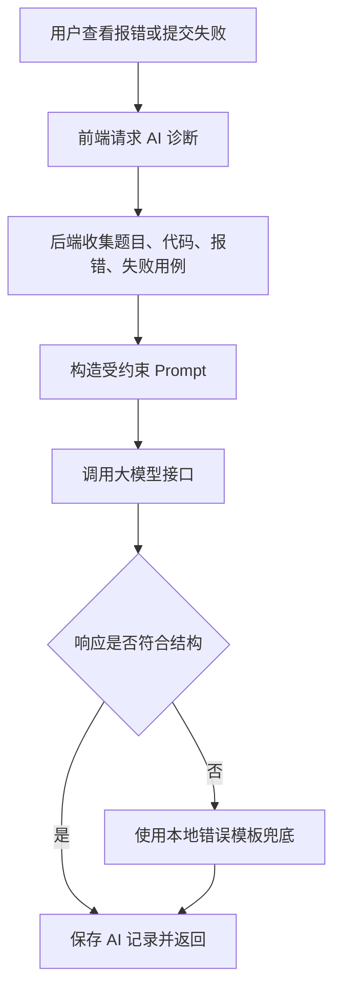
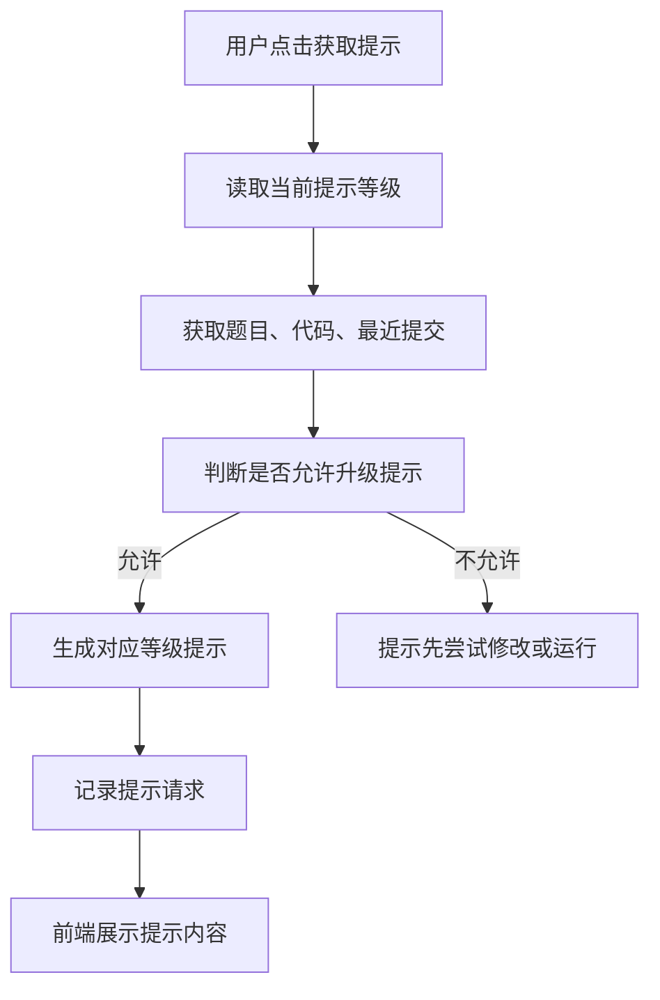
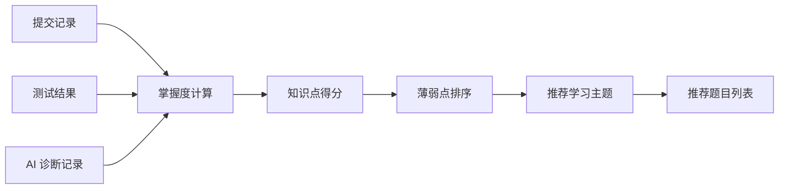

# AI 驱动的编程练习助手概要设计说明书

## 1. 文档目的

本文档用于在需求分析与功能草图的基础上，规划“AI 驱动的编程练习助手”的系统整体架构、模块划分、模块间接口、核心数据结构与关键业务实现逻辑，作为后续代码实现、测试设计和项目验收的技术蓝图。

本文档重点对应软件工程实验课中概要设计阶段的要求：

1. 规划系统整体架构。
2. 定义模块间接口。
3. 设计核心数据结构。
4. 设计关键业务的实现逻辑。

## 2. 设计依据与范围

### 2.1 设计依据

1. 《软件工程实验总要求.pptx》中关于概要设计阶段的要求。
2. 《需求分析说明书》中定义的业务场景、功能需求、非功能需求与 MVP 范围。
3. 《功能草图》中定义的页面结构、核心交互流程和前后端模块映射。

### 2.2 首期设计范围

首期系统围绕“练习 - 诊断 - 提示 - 成长反馈”主链路展开，纳入以下能力：

1. 用户注册、登录与学习档案维护。
2. 首页推荐、题库浏览与题目详情。
3. 在线代码编辑、运行和提交评测。
4. AI 错误诊断与分层提示。
5. 学习记录、能力画像与学习路径推荐。
6. 简易题库管理能力。

### 2.3 首期暂不设计范围

1. 多编程语言执行环境。
2. 生产级分布式沙箱集群。
3. 完整班级管理、作业管理和考试防作弊系统。
4. 大规模并发、复杂权限体系和商业化计费系统。

## 3. 总体设计原则

1. 高内聚、低耦合：用户、题库、评测、AI、推荐等模块职责清晰，便于独立开发和测试。
2. 主链路优先：优先保证用户能完成一次完整练习流程，再扩展教师后台和增强功能。
3. AI 可控可解释：AI 输出使用固定结构与提示等级，避免直接代写完整答案。
4. 数据可追溯：运行结果、提交记录、AI 诊断、提示请求均记录到数据库，支撑成长画像与测试验收。
5. 安全优先：代码执行设置时间、内存、输入输出和危险操作限制，敏感配置不暴露到前端。
6. 易于课程演示：技术选型轻量，支持本地部署、小规模课堂演示和文档化交付。

## 4. 技术架构设计

### 4.1 技术选型

| 层次 | 建议技术 | 选择理由 |
| --- | --- | --- |
| 前端 | React + Vite + TypeScript | 开发效率高，组件化清晰，适合构建交互式练习页面 |
| 代码编辑器 | Monaco Editor | 支持代码高亮、行号、编辑体验接近常见 IDE |
| 后端 | Python FastAPI | 与 Python 练习主题一致，接口开发简洁，自动生成 OpenAPI 文档 |
| ORM | SQLAlchemy | 便于维护数据库模型与查询逻辑 |
| 数据库 | SQLite 首期演示，预留 PostgreSQL 迁移能力 | SQLite 部署简单，适合课程项目；表结构可平滑迁移 |
| AI 接入 | 后端封装 LLM Client | 统一管理 Prompt、密钥、调用日志和降级策略 |
| 代码执行 | 本地受限 Python 子进程，后续可替换 Docker 沙箱 | 首期实现成本可控，模块接口保留扩展空间 |
| 测试 | Pytest + 前端组件测试 | 覆盖评测、推荐、AI 输出结构等核心逻辑 |

### 4.2 技术栈说明与优缺点分析

#### 4.2.1 前端技术栈：React + Vite + TypeScript

前端采用 `React + Vite + TypeScript` 作为核心技术栈，用于实现首页仪表盘、题库列表、题目练习页、AI 诊断侧栏、学习路径和个人中心等交互页面。

优点：

1. 组件化能力强：React 适合将题目卡片、代码编辑器、运行结果面板、AI 提示面板和统计卡片拆分为独立组件，便于多人协作和后期维护。
2. 交互开发效率高：本项目包含在线编码、运行反馈、提示切换、结果展示等较多前端状态变化，React 的状态驱动视图模型适合此类界面。
3. 本地开发体验好：Vite 启动快、热更新快，适合课程项目在短周期内频繁调整页面和接口。
4. 类型约束更可靠：TypeScript 可为题目、提交记录、AI 诊断结果、学习路径等核心数据定义类型，减少前后端字段不一致造成的运行错误。
5. 生态成熟：React 生态中可方便集成 Monaco Editor、图表组件、路由和请求库，能支撑在线编程练习助手的主要页面能力。

缺点：

1. 学习成本高于原生 HTML/CSS/JavaScript，需要掌握组件、Props、Hooks、状态管理和 TypeScript 类型。
2. 项目结构相对复杂，需要维护依赖、构建配置、类型定义和前后端接口封装。
3. TypeScript 前期会增加一定编码量，需要为接口响应、组件参数和状态数据建立类型。
4. 如果状态边界设计不清晰，代码编辑器内容、运行结果、AI 提示和用户登录态容易耦合在同一页面中。

适配结论：本项目不是静态展示页，而是包含在线编辑、实时反馈、AI 侧栏和学习看板的交互式 Web 应用，因此使用 `React + Vite + TypeScript` 的收益高于其复杂度。实现时应将页面、组件、API 客户端和类型定义分层管理，避免前端状态混乱。

#### 4.2.2 后端技术栈：Python FastAPI + SQLAlchemy

后端采用 `Python FastAPI` 提供 REST API，并通过 `SQLAlchemy` 管理数据库模型与查询逻辑。

优点：

1. 与项目主题一致：系统本身服务于 Python 编程练习，后端使用 Python 便于团队统一语言和调试环境。
2. 接口开发简洁：FastAPI 支持请求参数校验、响应模型和自动 OpenAPI 文档，便于前后端联调。
3. 模块化清晰：可按 routers、services、repositories、models、schemas 分层组织代码，与概要设计中的模块划分一致。
4. 测试友好：FastAPI 与 Pytest 结合方便，可快速编写接口测试和业务逻辑测试。

缺点：

1. 对高并发和长耗时任务需要额外设计，代码执行和 AI 调用不能直接阻塞主流程太久。
2. 团队需要遵守清晰的分层约定，否则容易把业务逻辑堆到路由函数中。
3. 若后续部署到生产环境，需要补充进程管理、反向代理、日志采集和安全配置。

适配结论：FastAPI 适合首期快速实现用户、题库、评测、AI 和推荐接口。对耗时的代码执行和 AI 调用，应封装在独立服务类中，并设置超时和兜底策略。

#### 4.2.3 数据库技术栈：SQLite，预留 PostgreSQL

首期数据库采用 `SQLite`，用于保存用户、题目、测试用例、提交记录、AI 诊断记录和学习推荐记录；设计上预留迁移到 `PostgreSQL` 的能力。

优点：

1. 部署简单：SQLite 不需要额外安装数据库服务，适合课程演示和本地开发。
2. 成本低：单文件数据库便于初始化、备份和随项目提交演示。
3. 结构清晰：配合 SQLAlchemy，可用统一模型描述数据表关系。

缺点：

1. 并发写入能力有限，不适合大规模用户同时提交代码。
2. 缺少 PostgreSQL 等服务型数据库的权限管理、连接池和高级索引能力。
3. 若后续进入多人长期使用场景，需要迁移到更稳健的数据库。

适配结论：SQLite 满足首期小规模演示需求。表结构设计应避免绑定 SQLite 特有能力，为后续 PostgreSQL 迁移保留空间。

#### 4.2.4 AI 与代码执行技术栈

AI 能力通过后端封装 `LlmClient` 接入，代码执行首期采用受限 Python 子进程实现，后续可替换为 Docker 沙箱或远程评测服务。

AI 接入优点：

1. 前端不直接接触模型密钥，安全性更高。
2. 后端可统一控制 Prompt 模板、输出结构、调用日志和失败兜底。
3. 可根据成本、稳定性或课程要求替换不同大模型服务。

AI 接入缺点：

1. 外部模型响应存在不确定性，需要结构化校验。
2. 网络波动或接口限流会影响诊断速度。
3. Prompt 设计不当可能导致 AI 直接给出完整答案，削弱学习引导效果。

代码执行优点：

1. 本地受限 Python 子进程实现成本低，能快速跑通运行与提交评测主链路。
2. 通过统一 `CodeRunner` 接口封装，后续可替换为 Docker 沙箱。
3. 能针对 Python 初学者常见错误快速返回 stdout、stderr、错误类型和超时状态。

代码执行缺点：

1. 本地子进程安全性弱于真正沙箱，需要严格限制危险调用、运行时间和输出长度。
2. 不适合高并发评测场景。
3. 对文件操作、网络访问和系统调用的隔离能力有限。

适配结论：首期采用“受限子进程 + 安全检查 + 超时控制”的轻量方案，满足课程项目演示；设计上通过 `CodeRunner` 保留升级沙箱的接口。

#### 4.2.5 测试技术栈：Pytest + 前端组件测试

测试层以后端 `Pytest` 为主，覆盖用户认证、题库查询、代码运行、提交评测、推荐规则和 AI 输出结构；前端补充关键组件和页面流程测试。

优点：

1. Pytest 编写成本低，适合快速覆盖业务函数和接口。
2. 后端核心逻辑可独立测试，减少手工点击验证成本。
3. 前端组件测试可验证题目卡片、结果面板、AI 侧栏等关键展示逻辑。

缺点：

1. 测试环境需要准备题库数据和用户数据。
2. 涉及 AI 的测试需要使用模拟响应，不能完全依赖真实模型接口。
3. 代码执行测试要控制超时和危险用例，避免影响本地环境。

适配结论：测试重点应放在主链路和异常分支，包括登录、选题、运行、提交、诊断和学习路径更新，确保系统可演示、可验收。

### 4.3 部署形态

首期采用“前后端分离 + 单体后端模块化”的架构：

1. 前端通过 HTTP API 调用后端服务。
2. 后端内部按业务域划分模块，但部署为一个 FastAPI 应用。
3. 数据统一存储在关系型数据库中。
4. AI 能力和代码执行能力作为后端内部服务封装，对前端隐藏实现细节。



## 5. 系统分层设计

### 5.1 前端分层

| 分层 | 职责 |
| --- | --- |
| 页面层 pages | 首页、题库页、题目练习页、学习路径页、个人中心、登录注册页 |
| 组件层 components | 题目卡片、代码编辑器、运行结果面板、AI 诊断面板、统计图表 |
| 状态层 store | 用户登录态、当前题目、编辑器代码、运行结果、提示等级 |
| API 客户端 api | 封装后端 REST API 调用、错误处理和 token 注入 |
| 工具层 utils | 时间格式化、难度映射、状态标签、表单校验 |

### 5.2 后端分层

| 分层 | 职责 |
| --- | --- |
| 路由层 routers | 暴露 HTTP API，处理请求参数校验与响应封装 |
| 服务层 services | 实现用户、题库、评测、AI、推荐等业务逻辑 |
| 数据访问层 repositories | 封装数据库查询与持久化操作 |
| 模型层 models/schemas | 定义数据库模型、请求 DTO、响应 DTO |
| 基础设施层 infrastructure | 执行器、AI 客户端、配置、日志、异常处理 |

### 5.3 建议代码目录

```text
.
├── code/
│   ├── backend/
│   │   ├── app/
│   │   │   ├── main.py
│   │   │   ├── core/
│   │   │   ├── models/
│   │   │   ├── schemas/
│   │   │   ├── routers/
│   │   │   ├── services/
│   │   │   ├── repositories/
│   │   │   └── infrastructure/
│   │   └── tests/
│   └── frontend/
│       ├── src/
│       │   ├── api/
│       │   ├── components/
│       │   ├── pages/
│       │   ├── store/
│       │   └── utils/
│       └── tests/
├── docs/
└── README.md
```

## 6. 功能模块设计

### 6.1 用户与认证模块

#### 6.1.1 模块职责

1. 用户注册、登录、退出。
2. 密码摘要存储与登录校验。
3. 维护用户学习阶段、基础资料和角色。
4. 为其他接口提供当前用户身份。

#### 6.1.2 输入输出

| 操作 | 输入 | 输出 |
| --- | --- | --- |
| 注册 | 用户名、邮箱、密码、学习阶段 | 用户基本信息 |
| 登录 | 账号、密码 | token、用户信息 |
| 获取档案 | token | 用户资料、学习阶段 |
| 更新档案 | token、学习阶段、昵称 | 更新后的用户资料 |

### 6.2 题库模块

#### 6.2.1 模块职责

1. 管理题目、知识点、难度、样例和测试用例。
2. 支持题目筛选、搜索、详情查看。
3. 支持管理员新增、编辑、上下架题目。
4. 为推荐模块和评测模块提供题目数据。

#### 6.2.2 输入输出

| 操作 | 输入 | 输出 |
| --- | --- | --- |
| 查询题目列表 | 知识点、难度、状态、关键词 | 分页题目列表 |
| 获取题目详情 | problem_id | 题干、样例、初始代码、标签 |
| 获取测试用例 | problem_id、评测权限 | 隐藏测试用例 |
| 管理题目 | 题干、难度、测试用例、参考解 | 题目记录 |

### 6.3 在线编程与评测模块

#### 6.3.1 模块职责

1. 接收用户代码并执行。
2. 区分“运行代码”和“提交评测”两种行为。
3. 返回标准输出、错误信息、测试用例通过情况。
4. 保存运行记录和提交记录。

#### 6.3.2 运行与提交区别

| 行为 | 目的 | 使用测试数据 | 是否计入成绩 | 是否更新画像 |
| --- | --- | --- | --- | --- |
| 运行代码 | 用户自测输出或查看报错 | 用户输入或公开样例 | 否 | 否 |
| 提交评测 | 判定题目完成情况 | 隐藏测试用例 | 是 | 是 |

### 6.4 AI 诊断与提示模块

#### 6.4.1 模块职责

1. 根据代码、报错、测试失败信息生成自然语言诊断。
2. 按提示等级输出思路提示、定位提示、关键代码建议。
3. 控制 AI 不直接输出完整可复制答案。
4. 记录 AI 调用结果，便于复盘和问题追踪。

#### 6.4.2 AI 输出结构

AI 诊断统一返回结构化内容：

```json
{
  "error_type": "TypeError",
  "summary": "错误含义说明",
  "possible_causes": ["可能原因 1", "可能原因 2"],
  "debug_steps": ["排查步骤 1", "排查步骤 2"],
  "related_concepts": ["类型转换", "字符串拼接"],
  "hint_level": 1,
  "hint_content": "当前等级提示内容",
  "confidence": "medium"
}
```

### 6.5 推荐与成长模块

#### 6.5.1 模块职责

1. 统计用户练习次数、通过率、最近表现。
2. 分析知识点掌握情况和高频错误类型。
3. 生成首页推荐题和学习路径建议。
4. 为个人中心提供能力画像数据。

#### 6.5.2 推荐策略

首期采用规则推荐，避免过早引入复杂机器学习模型：

1. 新用户按学习阶段推荐基础题。
2. 已有提交记录的用户优先推荐薄弱知识点题目。
3. 最近连续失败的知识点降低题目难度。
4. 最近连续通过的知识点提高题目难度或推荐综合题。
5. 高频错误类型关联到对应知识点和补充练习。

### 6.6 管理模块

#### 6.6.1 模块职责

1. 题目新增、编辑、上下架。
2. 测试用例维护。
3. 查看题目通过率和常见错误统计。

首期管理模块可以作为简易后台页面，也可以先通过受保护 API 配合初始化脚本完成题库维护。

## 7. 模块间接口设计

### 7.1 前后端接口统一约定

#### 7.1.1 请求约定

1. 接口路径统一以 `/api/v1` 开头。
2. 登录后请求通过 `Authorization: Bearer <token>` 传递身份。
3. 请求体和响应体统一使用 JSON。
4. 时间字段统一使用 ISO 8601 格式。

#### 7.1.2 响应约定

```json
{
  "success": true,
  "data": {},
  "message": "ok",
  "trace_id": "req-20260606-0001"
}
```

错误响应：

```json
{
  "success": false,
  "data": null,
  "message": "题目不存在",
  "trace_id": "req-20260606-0002"
}
```

### 7.2 用户接口

| 方法 | 路径 | 说明 |
| --- | --- | --- |
| POST | `/api/v1/auth/register` | 用户注册 |
| POST | `/api/v1/auth/login` | 用户登录 |
| GET | `/api/v1/users/me` | 获取当前用户信息 |
| PUT | `/api/v1/users/me/profile` | 更新学习档案 |

### 7.3 题库接口

| 方法 | 路径 | 说明 |
| --- | --- | --- |
| GET | `/api/v1/problems` | 查询题目列表 |
| GET | `/api/v1/problems/{problem_id}` | 获取题目详情 |
| POST | `/api/v1/admin/problems` | 新增题目 |
| PUT | `/api/v1/admin/problems/{problem_id}` | 编辑题目 |
| PATCH | `/api/v1/admin/problems/{problem_id}/status` | 上下架题目 |

题目列表查询参数：

| 参数 | 类型 | 必填 | 说明 |
| --- | --- | --- | --- |
| keyword | string | 否 | 按标题或题干搜索 |
| knowledge_point | string | 否 | 知识点筛选 |
| difficulty | string | 否 | 难度筛选 |
| status | string | 否 | 用户完成状态 |
| page | int | 否 | 页码 |
| page_size | int | 否 | 每页数量 |

### 7.4 运行评测接口

| 方法 | 路径 | 说明 |
| --- | --- | --- |
| POST | `/api/v1/problems/{problem_id}/run` | 运行用户代码 |
| POST | `/api/v1/problems/{problem_id}/submit` | 提交评测 |
| GET | `/api/v1/submissions/{submission_id}` | 获取提交详情 |
| GET | `/api/v1/users/me/submissions` | 获取个人提交历史 |

运行请求：

```json
{
  "code": "def solve():\n    pass",
  "stdin": "3\n1 2 3\n"
}
```

运行响应：

```json
{
  "run_id": 12,
  "status": "runtime_error",
  "stdout": "",
  "stderr": "TypeError: ...",
  "time_ms": 120,
  "memory_kb": 10240,
  "error_type": "TypeError"
}
```

提交响应：

```json
{
  "submission_id": 31,
  "status": "wrong_answer",
  "passed_count": 3,
  "total_count": 6,
  "failed_cases": [
    {
      "case_id": 4,
      "input_preview": "[1, 1, 2]",
      "expected_preview": "[1, 2]",
      "actual_preview": "[1, 1, 2]"
    }
  ],
  "error_type": null
}
```

### 7.5 AI 接口

| 方法 | 路径 | 说明 |
| --- | --- | --- |
| POST | `/api/v1/ai/diagnose` | 生成错误诊断 |
| POST | `/api/v1/ai/hints` | 获取分层提示 |
| GET | `/api/v1/ai/records/{record_id}` | 查看诊断记录 |

诊断请求：

```json
{
  "problem_id": 8,
  "submission_id": 31,
  "code": "用户代码",
  "stderr": "报错信息",
  "failed_cases": [],
  "request_type": "error_diagnosis"
}
```

提示请求：

```json
{
  "problem_id": 8,
  "code": "用户代码",
  "hint_level": 2,
  "last_submission_id": 31
}
```

### 7.6 推荐与成长接口

| 方法 | 路径 | 说明 |
| --- | --- | --- |
| GET | `/api/v1/recommendations/today` | 获取今日推荐 |
| GET | `/api/v1/learning-path/me` | 获取学习路径 |
| GET | `/api/v1/dashboard/me` | 获取个人看板 |
| GET | `/api/v1/users/me/weak-points` | 获取薄弱知识点 |

看板响应示例：

```json
{
  "completed_problem_count": 18,
  "accepted_problem_count": 11,
  "recent_pass_rate": 0.72,
  "top_error_types": ["IndexError", "IndentationError", "TypeError"],
  "weak_knowledge_points": ["列表索引", "函数参数"],
  "trend": [
    {"date": "2026-06-01", "pass_rate": 0.4},
    {"date": "2026-06-02", "pass_rate": 0.55}
  ]
}
```

## 8. 核心数据结构设计

### 8.1 实体关系概览



### 8.2 用户表 users

| 字段 | 类型 | 说明 |
| --- | --- | --- |
| id | integer | 主键 |
| username | varchar | 用户名，唯一 |
| email | varchar | 邮箱，唯一 |
| password_hash | varchar | 密码摘要 |
| role | varchar | student/admin |
| learning_stage | varchar | zero/basic/practice |
| created_at | datetime | 注册时间 |
| updated_at | datetime | 更新时间 |

### 8.3 题目表 problems

| 字段 | 类型 | 说明 |
| --- | --- | --- |
| id | integer | 主键 |
| title | varchar | 题目标题 |
| description | text | 题目描述 |
| difficulty | varchar | beginner/basic/intermediate |
| input_description | text | 输入说明 |
| output_description | text | 输出说明 |
| sample_input | text | 样例输入 |
| sample_output | text | 样例输出 |
| starter_code | text | 初始代码 |
| reference_solution | text | 参考解，管理员可见 |
| status | varchar | draft/published/offline |
| created_at | datetime | 创建时间 |
| updated_at | datetime | 更新时间 |

### 8.4 知识点表 knowledge_points

| 字段 | 类型 | 说明 |
| --- | --- | --- |
| id | integer | 主键 |
| name | varchar | 知识点名称 |
| category | varchar | 所属分类 |
| description | text | 简要说明 |

题目与知识点为多对多关系，通过 `problem_knowledge_points` 关联：

| 字段 | 类型 | 说明 |
| --- | --- | --- |
| problem_id | integer | 题目 ID |
| knowledge_point_id | integer | 知识点 ID |

### 8.5 测试用例表 test_cases

| 字段 | 类型 | 说明 |
| --- | --- | --- |
| id | integer | 主键 |
| problem_id | integer | 所属题目 |
| input_data | text | 输入数据 |
| expected_output | text | 期望输出 |
| is_sample | boolean | 是否公开样例 |
| weight | integer | 权重 |
| created_at | datetime | 创建时间 |

### 8.6 运行记录表 run_records

| 字段 | 类型 | 说明 |
| --- | --- | --- |
| id | integer | 主键 |
| user_id | integer | 用户 ID |
| problem_id | integer | 题目 ID |
| code | text | 用户代码 |
| stdin | text | 自定义输入 |
| stdout | text | 标准输出 |
| stderr | text | 错误输出 |
| status | varchar | success/runtime_error/time_limit |
| error_type | varchar | 错误类型 |
| time_ms | integer | 运行耗时 |
| memory_kb | integer | 内存占用 |
| created_at | datetime | 运行时间 |

### 8.7 提交记录表 submissions

| 字段 | 类型 | 说明 |
| --- | --- | --- |
| id | integer | 主键 |
| user_id | integer | 用户 ID |
| problem_id | integer | 题目 ID |
| code | text | 提交代码 |
| status | varchar | accepted/wrong_answer/runtime_error/time_limit |
| passed_count | integer | 通过用例数 |
| total_count | integer | 总用例数 |
| error_type | varchar | 错误类型 |
| score | integer | 得分 |
| time_ms | integer | 最大或累计耗时 |
| created_at | datetime | 提交时间 |

### 8.8 测试结果表 test_results

| 字段 | 类型 | 说明 |
| --- | --- | --- |
| id | integer | 主键 |
| submission_id | integer | 提交 ID |
| test_case_id | integer | 测试用例 ID |
| status | varchar | passed/failed/runtime_error |
| actual_output | text | 实际输出 |
| error_message | text | 错误信息 |
| time_ms | integer | 单用例耗时 |

### 8.9 AI 记录表 ai_records

| 字段 | 类型 | 说明 |
| --- | --- | --- |
| id | integer | 主键 |
| user_id | integer | 用户 ID |
| problem_id | integer | 题目 ID |
| submission_id | integer | 可为空，关联提交 |
| request_type | varchar | diagnosis/hint/path |
| prompt_summary | text | Prompt 摘要，不保存敏感密钥 |
| response_json | text | 结构化响应 |
| hint_level | integer | 提示等级 |
| confidence | varchar | high/medium/low |
| created_at | datetime | 创建时间 |

### 8.10 学习推荐表 learning_recommendations

| 字段 | 类型 | 说明 |
| --- | --- | --- |
| id | integer | 主键 |
| user_id | integer | 用户 ID |
| target_knowledge_point_id | integer | 推荐知识点 |
| reason | text | 推荐原因 |
| recommended_problem_ids | text | 推荐题目 ID 列表，JSON 存储 |
| status | varchar | active/completed/ignored |
| created_at | datetime | 创建时间 |

## 9. 关键业务流程设计

### 9.1 用户登录流程



异常处理：

1. 用户不存在或密码错误：返回统一错误提示，避免暴露账号是否存在。
2. 用户被禁用：返回账户状态异常。
3. 参数缺失：返回字段级校验错误。

### 9.2 首页推荐流程



推荐规则：

1. 无历史记录：推荐当前学习阶段下通过率较高、难度较低的题目。
2. 最近 5 次提交中某知识点通过率低于 60%：优先推荐该知识点的基础题。
3. 某知识点连续 3 次通过：推荐相同知识点更高难度题或综合题。
4. 用户已完成题目默认不重复推荐，除非其状态为错题。

### 9.3 代码运行流程



执行限制：

1. 默认运行超时时间为 3 秒。
2. 标准输出最大保存长度为 4000 字符。
3. 禁止或拦截明显危险的模块和系统调用，如 `os.system`、`subprocess`、文件删除等。
4. 若触发限制，返回 `runtime_error` 或 `time_limit` 状态，并提示用户当前环境仅支持基础练习代码。

### 9.4 提交评测流程



判定规则：

1. 全部测试用例通过：状态为 `accepted`。
2. 存在输出不一致：状态为 `wrong_answer`。
3. 执行期间出现异常：状态为 `runtime_error`，记录错误类型。
4. 超过时间限制：状态为 `time_limit`。
5. 首期按测试用例通过比例计算分数：`score = passed_count / total_count * 100`。

### 9.5 AI 错误诊断流程



Prompt 约束：

1. 角色限定为 Python 初学者学习助手。
2. 必须按“错误解释、可能原因、排查步骤、相关知识点、提示等级”输出。
3. 不允许直接给出完整可复制答案。
4. 对不确定内容使用“可能”“建议检查”等表述。
5. 优先解释与当前题目和当前代码有关的问题。

兜底策略：

1. 若 AI 接口不可用，针对常见错误类型返回本地模板。
2. 若 AI 响应无法解析为结构化 JSON，保留原文摘要并返回通用诊断。
3. 若用户连续请求三级提示，可展示更具体伪代码，但仍避免完整答案。

### 9.6 分层提示流程

提示等级定义：

| 等级 | 名称 | 内容边界 |
| --- | --- | --- |
| 1 | 思路提示 | 解释题目拆解、输入输出关系、可能使用的知识点 |
| 2 | 定位提示 | 指出代码中可能存在问题的区域或判断条件 |
| 3 | 关键代码建议 | 给出伪代码或局部关键语句，不提供完整提交代码 |

流程：



升级规则：

1. 默认从一级提示开始。
2. 用户已查看低一级提示后，才允许请求下一级提示。
3. 若用户没有提交或运行记录，三级提示需引导其先尝试运行。
4. 频繁请求高等级提示时，在成长画像中记录“提示依赖”指标。

### 9.7 学习路径生成流程



知识点掌握度计算：

```text
mastery_score =
  0.5 * 最近提交通过率
  + 0.3 * 该知识点题目完成比例
  + 0.2 * 最近错误减少趋势
```

掌握度分级：

| 分数 | 等级 | 推荐策略 |
| --- | --- | --- |
| 0 - 0.4 | 薄弱 | 推荐基础讲解和低难度题 |
| 0.4 - 0.7 | 巩固中 | 推荐同难度针对练习 |
| 0.7 - 1.0 | 掌握较好 | 推荐更高难度或综合题 |

## 10. 核心类与服务设计

### 10.1 后端核心服务

| 服务类 | 主要方法 | 职责 |
| --- | --- | --- |
| AuthService | register, login, get_current_user | 用户注册登录与身份校验 |
| ProblemService | list_problems, get_problem, create_problem | 题库查询与管理 |
| JudgeService | run_code, submit_code, evaluate_cases | 执行代码和评测测试用例 |
| AiTutorService | diagnose_error, generate_hint | AI 诊断与提示 |
| RecommendationService | get_today_recommendations, build_learning_path | 推荐题目和学习路径 |
| DashboardService | get_user_dashboard, analyze_weak_points | 个人看板与薄弱点分析 |

### 10.2 代码执行器接口

为便于后续从本地子进程切换到 Docker 或远程沙箱，执行器应抽象为统一接口：

```python
class CodeRunner:
    def run(
        self,
        code: str,
        stdin: str,
        timeout_seconds: int = 3
    ) -> RunResult:
        ...
```

`RunResult` 数据结构：

```python
class RunResult:
    status: str
    stdout: str
    stderr: str
    error_type: str | None
    time_ms: int
    memory_kb: int | None
```

### 10.3 AI 客户端接口

```python
class LlmClient:
    def complete_json(
        self,
        system_prompt: str,
        user_prompt: str,
        schema_name: str
    ) -> dict:
        ...
```

AI 服务层不直接拼接 HTTP 请求，而是通过 `LlmClient` 调用，便于替换模型、增加重试、记录日志和实现兜底。

## 11. 安全设计

### 11.1 身份认证安全

1. 密码使用哈希算法存储，不保存明文。
2. 登录 token 设置过期时间。
3. 管理接口必须校验 `admin` 角色。
4. 前端不保存 AI 密钥、数据库密码等敏感信息。

### 11.2 代码执行安全

1. 运行前进行基础静态检查，拦截明显危险代码。
2. 运行时设置超时时间，防止死循环长时间占用资源。
3. 限制输出长度，避免大量打印拖垮页面和数据库。
4. 执行环境与后端主进程隔离，首期至少使用独立子进程。
5. 后续可将 `CodeRunner` 替换为 Docker 沙箱实现。

### 11.3 AI 调用安全

1. AI 密钥仅存储在后端环境变量中。
2. Prompt 中不包含用户密码、token 等敏感信息。
3. 对 AI 输出进行结构校验和长度限制。
4. 对直接索要答案的请求使用引导式提示策略。

## 12. 异常处理与日志设计

### 12.1 统一异常分类

| 异常类型 | 示例 | 前端展示 |
| --- | --- | --- |
| 参数异常 | 缺少 problem_id | 表单或请求参数提示 |
| 认证异常 | token 过期 | 跳转登录或重新登录 |
| 权限异常 | 非管理员修改题目 | 无权限提示 |
| 业务异常 | 题目已下架 | 友好说明并返回题库 |
| 执行异常 | 代码超时、运行错误 | 展示运行状态和 AI 诊断入口 |
| 外部服务异常 | AI 接口失败 | 使用本地模板兜底 |

### 12.2 日志内容

1. 请求日志：接口路径、用户 ID、耗时、状态码、trace_id。
2. 评测日志：problem_id、submission_id、执行状态、耗时。
3. AI 日志：request_type、record_id、响应状态、是否使用兜底。
4. 异常日志：错误堆栈、关联用户和 trace_id。

## 13. 性能与可扩展性设计

### 13.1 性能目标

| 场景 | 首期目标 |
| --- | --- |
| 题目列表查询 | 1 秒内返回 |
| 普通代码运行 | 3 秒超时控制 |
| 提交评测 | 5 秒内返回普通题结果 |
| 首页看板 | 1 秒内返回 |
| AI 诊断 | 10 秒内返回，超时使用兜底提示 |

### 13.2 可扩展点

1. 数据库可从 SQLite 切换到 PostgreSQL。
2. `CodeRunner` 可从本地子进程切换到 Docker 沙箱或远程评测服务。
3. `LlmClient` 可替换不同大模型供应商。
4. 推荐策略可从规则引擎升级为模型推荐。
5. 题库模块可扩展多语言字段，但首期仅启用 Python。

## 14. 前端页面与模块映射

| 页面 | 调用接口 | 关键组件 |
| --- | --- | --- |
| 登录/注册页 | auth/register, auth/login | 登录表单、注册表单 |
| 首页 | recommendations/today, dashboard/me | 推荐题卡片、学习概览、继续练习 |
| 题库页 | problems | 筛选栏、分类导航、题目列表 |
| 题目练习页 | problems/{id}, run, submit, ai/diagnose, ai/hints | 题目描述、Monaco 编辑器、结果面板、AI 侧栏 |
| 学习路径页 | learning-path/me, weak-points | 路径列表、薄弱点分析、趋势图 |
| 个人中心 | users/me, submissions | 用户资料、历史提交、错题本 |
| 管理页 | admin/problems | 题目表单、测试用例编辑器 |

## 15. 数据初始化设计

首期需要准备基础题库数据，建议至少覆盖以下知识点：

1. 变量与基础输入输出。
2. 条件判断。
3. 循环控制。
4. 列表与字符串。
5. 函数参数与返回值。
6. 常见异常处理。

每个知识点至少准备 3 道题：

1. 基础题：检验语法掌握。
2. 巩固题：包含简单边界条件。
3. 综合题：结合多个知识点。

题目初始化文件建议使用 JSON 或 YAML，便于版本管理与重复导入。

## 16. 测试设计衔接

本概要设计为后续《测试设计及结果报告书》提供以下测试关注点：

1. 用户注册登录和权限校验。
2. 题目筛选、详情展示和管理维护。
3. 代码运行的正常输出、语法错误、运行时错误、超时。
4. 提交评测的通过、答案错误、异常、边界输入。
5. AI 诊断的结构完整性和提示分级约束。
6. 学习路径推荐是否随提交记录变化。
7. 前端主流程是否能在 3 分钟内完成一次练习。

## 17. 风险与应对

| 风险 | 影响 | 应对方案 |
| --- | --- | --- |
| AI 输出不稳定 | 诊断质量波动 | 使用固定输出结构、本地模板兜底、保存诊断记录 |
| 代码执行存在安全风险 | 影响系统稳定和数据安全 | 子进程隔离、超时限制、危险调用拦截、后续替换沙箱 |
| 推荐算法过于复杂 | 开发周期失控 | 首期采用透明规则推荐 |
| 题库质量不足 | 用户体验下降 | 先覆盖基础高频知识点，每题配置样例和隐藏用例 |
| 文档与代码不一致 | 验收困难 | 按本文档目录和接口实现，变更时同步更新文档 |

## 18. 概要设计结论

本系统采用前后端分离、后端模块化单体的架构，围绕用户、题库、评测、AI 诊断、推荐成长五个核心业务域展开。首期设计重点不是追求复杂平台能力，而是保证“用户开始练习、提交代码、获得反馈、查看成长建议”这一主链路稳定可运行。

通过统一接口约定、清晰的数据模型、可替换的代码执行器和 AI 客户端抽象，系统既能满足课程项目在短周期内完成编码实现与验收演示的要求，也为后续扩展教师后台、沙箱执行、多语言题库和更智能的推荐策略留下空间。
