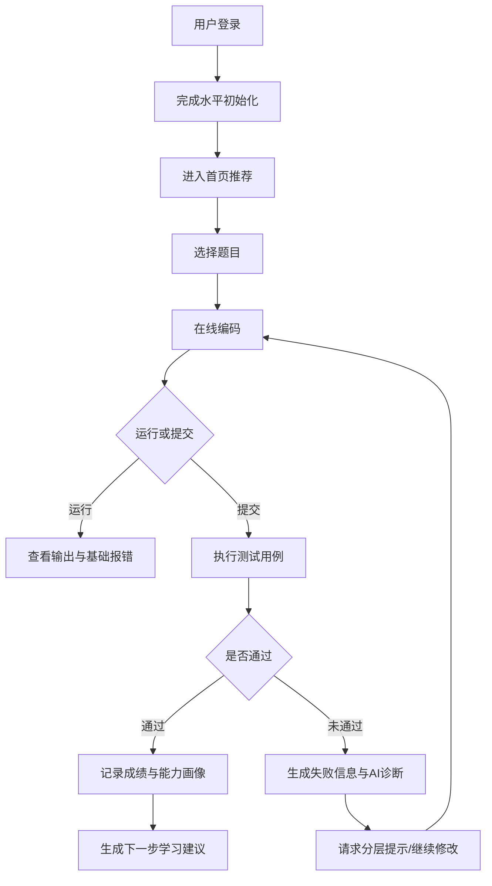

# AI 驱动的编程练习助手需求分析说明书

## 1. 文档目的

本文档用于明确“AI 驱动的编程练习助手”项目的业务场景、目标用户、核心诉求、功能边界与首期开发范围，作为后续概要设计、任务拆解、编码实现和测试验收的基准文档。

## 2. 项目背景

### 2.1 课题来源

根据课程给定选题，本项目定位为一个面向 Python 初学者的交互式 Web 应用，集成 AI 助手能力，为用户提供个性化编程练习、错误诊断与学习路径推荐。

### 2.2 业务问题

对编程初学者而言，学习 Python 的主要障碍通常不在“没有资源”，而在“资源太多但缺乏针对性支持”。常见问题包括：

1. 练习难度不匹配：题目过难会挫败，过易则缺乏成长。
2. 报错看不懂：初学者难以理解报错含义、定位错误位置、判断修复步骤。
3. 学习路径不清晰：知道“要继续学”，但不知道下一步应该补哪一块。
4. 缺少即时反馈：课堂外练习往往依赖搜索、问同学或等待教师答疑，反馈周期长。
5. 容易依赖 AI 直接给答案：虽然效率高，但会削弱独立思考和调试能力。

### 2.3 调研结论摘要

结合公开资料与教学研究，可以得到以下对本项目有直接价值的判断：

1. Python 仍是极具现实意义的学习入口语言。GitHub 于 2024 年 10 月 29 日发布的 Octoverse 2024 显示，Python 已成为 GitHub 上使用最多的语言，反映其在 AI、数据与通用开发中的持续上升趋势。
2. 初学者学习编码主要依赖在线资源。Stack Overflow 2024 Developer Survey 显示，84% 的受访者通过技术文档学习编码，80% 使用 Stack Overflow，37% 表示会借助 AI 学习。
3. 学习者对 AI 辅助持积极但不完全信任的态度。同期调查显示，AI 的主要价值之一是“加速学习”；但关于 AI 输出准确性，开发者整体仍明显分化，且“错误信息/误导内容”是最受关注的伦理问题之一。
4. 新手调试存在明显共性难点。2025-2026 年的研究指出，初学者在 Python 调试中常表现出缺少系统性、反复试错、错误定位困难、情绪受挫等问题；更有效的支持方式并不是直接给答案，而是提供与上下文相关的定位提示、分步引导和针对课程内容的解释。

由此可见，本项目的价值不只是“做一个聊天框”，而是构建一个围绕“练习-诊断-引导-成长”的闭环学习工具。

## 3. 项目目标

### 3.1 总体目标

开发一个面向 Python 初学者的 Web 学习助手，帮助用户在刷题、写代码和调试过程中获得即时、个性化、可解释的学习支持，并形成可视化成长路径。

### 3.2 首期目标

首期版本以“单人自学场景”作为核心，聚焦以下四个结果：

1. 用户能快速开始一道适合自己水平的 Python 练习。
2. 用户提交代码后能获得运行结果、测试反馈和 AI 错误诊断。
3. 用户在不会做时能获得分层提示，而不是直接完整答案。
4. 用户完成练习后能看到能力画像和下一步学习建议。

### 3.3 成功标准

若首期版本上线后能满足以下条件，则认为目标达成：

1. 用户可在 3 分钟内完成注册、选题并开始编码。
2. 80% 以上的典型新手报错可被系统归类并给出可读解释。
3. 同一题目支持至少 3 级提示策略：思路提示、定位提示、关键知识点提示。
4. 用户能够查看最近练习记录、错误类型分布和推荐学习路径。
5. 系统能稳定支持课堂演示或小规模组内试用。

## 4. 干系人分析

### 4.1 主要干系人

1. 学生用户：Python 初学者，是系统核心服务对象。
2. 教师/助教：关注题目质量、学习效果和演示可用性。
3. 项目开发团队：负责需求、设计、实现、测试和交付。

### 4.2 干系人诉求

| 干系人 | 核心诉求 |
| --- | --- |
| 学生 | 题目合适、反馈快、报错看得懂、知道下一步学什么 |
| 教师/助教 | 演示直观、功能完整、结果可解释、能够体现教学价值 |
| 开发团队 | 范围可控、模块清晰、便于迭代、可按课程周期交付 |

## 5. 目标用户与业务场景

### 5.1 目标用户画像

**用户画像 A：编程零基础新生**

- 刚接触 Python，熟悉变量、条件、循环等基础语法。
- 害怕报错，不知道如何阅读 Traceback。
- 需要低门槛、及时反馈和鼓励式引导。

**用户画像 B：正在准备课程作业/机考的学生**

- 已能完成简单题目，但做题速度慢、调试效率低。
- 希望针对薄弱点刷题，减少无效重复练习。

**用户画像 C：助教或教师**

- 希望快速查看题目配置、学生常见错误类型和学习进展。
- 首期不强调复杂教学管理，但希望有基本演示面板或题库管理能力。

### 5.2 核心业务场景

**场景 1：日常自主练习**

学生登录后，选择“基础语法”“列表与字符串”“函数”“异常处理”等主题，系统结合其历史表现推荐题目。学生在在线编辑器中完成代码，提交后获得测试结果与 AI 反馈。

**场景 2：卡在报错时求助**

学生提交代码后出现 `SyntaxError`、`TypeError`、`IndexError` 等错误。系统自动提取报错信息和代码上下文，生成“错误解释 + 可能原因 + 修复建议 + 相关知识点”。

**场景 3：不会做但不想被直接剧透**

学生在题目页面主动请求提示。系统按层级给出思路引导，优先提供问题拆解、输入输出分析和关键知识点提醒，而不是直接输出完整代码。

**场景 4：阶段性复盘**

学生完成若干练习后，在个人中心查看掌握情况、薄弱知识点、高频错误分布与下一阶段推荐学习路径。

## 6. 核心用户诉求

### 6.1 显性诉求

1. 我要有题可练，而且难度适合我。
2. 我要知道代码为什么错，而不是只看到红字报错。
3. 我要在不会做时得到提示，但又不想完全抄答案。
4. 我要知道自己学到了哪里、还差什么。

### 6.2 隐性诉求

1. 降低面对报错时的焦虑感。
2. 建立“能自己调试”的信心，而不是对 AI 形成依赖。
3. 在有限时间内感受到持续进步。

### 6.3 需求优先级判断

从首期产品价值与课程实现成本综合考虑，优先级排序如下：

1. 题目练习与在线编程
2. 提交评测与错误诊断
3. 分层提示与知识点解释
4. 学习路径推荐与进度看板
5. 教师侧扩展能力

## 7. 功能范围界定

### 7.1 首期纳入范围

#### 7.1.1 用户与学习档案

1. 用户注册/登录
2. 基础资料维护
3. 学习阶段初始化评估或自选水平
4. 学习记录、做题历史、错误画像展示

#### 7.1.2 题库与练习推荐

1. Python 基础题库管理
2. 按知识点、难度、题型进行筛选
3. 基于历史表现推荐练习
4. 支持“今日推荐”“继续练习”“针对薄弱点练习”

#### 7.1.3 在线编程与运行反馈

1. 题目详情页展示题干、样例、约束、知识点
2. 在线代码编辑器
3. 运行代码查看输出
4. 提交代码进行测试用例校验
5. 展示通过情况、失败用例和耗时信息

#### 7.1.4 AI 错误诊断与提示

1. 对常见 Python 报错进行自然语言解释
2. 给出可能原因与排查步骤
3. 基于代码上下文生成分层提示
4. 提供相关知识点链接或简要说明
5. 对存在直接求完整答案倾向的场景进行提示约束

#### 7.1.5 学习路径与成长反馈

1. 生成阶段性能力画像
2. 推荐下一阶段学习主题
3. 展示高频错误类型和最近进步趋势
4. 提供“先补知识点还是继续练题”的建议

### 7.2 条件纳入范围

若开发进度允许，可增加以下增强功能：

1. 简易教师后台：题目维护、查看常见错误统计
2. AI 对话问答侧栏：围绕当前题目进行追问
3. 排行榜或学习打卡机制
4. 收藏题目、错题本、笔记功能

### 7.3 首期明确不做

为控制课程项目复杂度，以下内容不纳入首期开发范围：

1. 多编程语言支持，仅支持 Python。
2. 大规模在线考试防作弊系统。
3. 完整 LMS 教学平台功能，如班级排课、作业布置、成绩册。
4. 复杂的多人协作编程或实时结对编程。
5. 真正意义上的代码安全沙箱集群调度与高并发生产级部署。
6. 直接生成满分答案并允许一键复制提交的设计。

## 8. 产品边界与设计原则

### 8.1 产品定位边界

本项目定位为“面向初学者的 AI 学习辅助工具”，不是：

1. 通用大模型聊天网站
2. 全功能在线判题平台
3. 面向企业开发者的代码助手
4. 完整课程管理系统

### 8.2 AI 能力边界

AI 在本系统中的职责是“讲解、引导、诊断、推荐”，而不是“代替思考、直接代写”。

具体约束如下：

1. 默认优先输出思路与定位建议，限制直接给出完整解法。
2. 对高风险回答增加免责声明，例如“以下建议需结合运行结果验证”。
3. 记录用户是否频繁索取答案，作为后续提示策略调整依据。
4. 对诊断结果保留“可能原因”表述，避免伪确定性。

## 9. 业务流程分析

### 9.1 核心业务流程

### 9.2 关键业务规则

1. 每道题需绑定知识点、难度等级、标准答案与测试用例。
2. 代码运行与提交反馈需区分“运行错误”“结果错误”“通过”三类状态。
3. AI 提示分级输出，默认不跨级。
4. 学习路径推荐优先参考最近若干次练习表现和高频错误类型。

## 10. 功能需求说明

### 10.1 功能模块总览

| 模块 | 说明 | 优先级 |
| --- | --- | --- |
| 用户模块 | 登录、档案、学习记录 | 高 |
| 题库模块 | 题目展示、筛选、推荐 | 高 |
| 编程模块 | 编辑、运行、提交、结果反馈 | 高 |
| AI 辅助模块 | 错误诊断、提示、解释、推荐 | 高 |
| 成长模块 | 画像、路径、趋势、错题 | 中高 |
| 管理模块 | 题库管理、统计查看 | 中 |

### 10.2 详细功能需求

#### FR-01 用户注册与登录

- 用户可通过账号密码完成注册与登录。
- 系统保存用户基础档案、学习阶段和练习记录。

#### FR-02 水平初始化

- 首次进入时，用户可选择“零基础/已学基础语法/准备刷题巩固”等阶段。
- 系统也可通过简短测评题初始化用户水平。

#### FR-03 题目浏览与推荐

- 首页展示推荐题、继续练习、薄弱点强化练习。
- 用户可按知识点、难度、状态筛选题目。

#### FR-04 在线代码编辑

- 提供基础代码编辑器，支持 Python 代码输入。
- 展示题目描述、输入输出示例和知识点标签。

#### FR-05 代码运行

- 用户可执行“运行代码”查看输出和运行时错误。
- 系统返回控制台输出、错误类型和简要提示。

#### FR-06 代码提交与评测

- 用户提交后，系统使用预设测试用例进行判定。
- 返回通过率、失败样例、错误信息和提交时间。

#### FR-07 AI 错误诊断

- 针对报错信息与失败结果生成可读解释。
- 输出建议包括：错误含义、可能原因、建议排查顺序、涉及知识点。

#### FR-08 分层提示

- 提示至少分为三级：
  1. 思路提示
  2. 错误定位提示
  3. 关键代码片段或伪代码提示

#### FR-09 学习路径推荐

- 基于用户当前水平、历史练习与知识点表现生成推荐。
- 推荐内容包括：下一主题、建议题量、先修知识点。

#### FR-10 个人成长看板

- 展示累计练习数、通过率、最近学习趋势、高频错误类型、薄弱知识点。

#### FR-11 题库管理

- 管理员可新增、编辑、上下架题目。
- 每道题维护题干、难度、标签、样例、测试用例和参考解。

## 11. 非功能需求

### 11.1 易用性

1. 界面对初学者友好，主要流程不超过 3 次跳转即可开始练习。
2. 报错解释使用自然语言，避免堆砌术语。

### 11.2 性能

1. 普通题目代码运行反馈应控制在可接受范围内。
2. AI 诊断响应应尽量保持在用户可等待的交互阈值内。
3. 小规模课堂演示场景下系统应稳定运行。

### 11.3 安全

1. 需限制代码执行环境，避免危险系统调用。
2. 用户密码需进行安全存储。
3. 不在前端暴露敏感密钥。

### 11.4 可维护性

1. 模块划分清晰，题库、评测、AI 服务、前端展示相互解耦。
2. 关键逻辑需有必要注释与文档说明。

### 11.5 可扩展性

1. 后续应便于扩展更多知识点、题型或语言。
2. AI 提示策略与推荐规则需支持独立迭代。

## 12. 数据需求

### 12.1 核心实体

1. 用户
2. 题目
3. 知识点
4. 提交记录
5. 测试结果
6. AI 诊断记录
7. 学习路径推荐记录

### 12.2 关键数据项示例

| 实体 | 关键字段 |
| --- | --- |
| 用户 | 用户名、密码摘要、学习阶段、注册时间 |
| 题目 | 标题、题干、难度、标签、标准答案、测试用例 |
| 提交记录 | 用户ID、题目ID、代码内容、运行结果、提交时间 |
| AI 诊断记录 | 提交ID、错误类型、诊断说明、提示等级 |

## 13. 风险与约束

### 13.1 项目约束

1. 课程周期短，首期必须控制功能范围。
2. 团队规模有限，不适合构建过重的教学后台。
3. AI 接口调用成本与稳定性可能影响演示体验。

### 13.2 主要风险

1. AI 输出不稳定，可能出现误判或过度回答。
2. 在线代码执行涉及安全隔离与异常处理。
3. 题库质量不足会直接影响产品体验。
4. 若功能铺得过大，容易导致文档、代码、测试都不扎实。

### 13.3 风险应对

1. 优先覆盖常见报错类型，避免追求全能。
2. 对 AI 输出设置模板与约束，增强一致性。
3. 题库首期聚焦基础 Python 高频知识点。
4. 以 MVP 先跑通主链路，再决定是否扩展教师侧功能。

## 14. 首期 MVP 范围定义

结合课程周期与评分要求，建议首期 MVP 锁定为：

1. 用户登录
2. 首页推荐题目
3. 题目详情与在线编辑器
4. 运行/提交/测试反馈
5. AI 错误诊断
6. 分层提示
7. 个人学习记录与基础路径推荐

这条链路完整覆盖了“开始练习-遇到问题-得到帮助-形成反馈”的核心价值，也是最能体现题目特色与工程完整度的部分。

## 15. 验收口径

首期需求验收以以下问题为准：

1. 用户是否能独立完成一次完整练习流程？
2. 系统是否能对常见 Python 错误给出可读解释？
3. AI 是否体现“辅助学习”而非“直接代做”？
4. 是否能基于练习结果给出下一步推荐？
5. 文档、代码、测试是否围绕上述核心链路保持一致？

## 16. 结论

“AI 驱动的编程练习助手”的核心价值，不是简单叠加“题库 + 聊天”，而是为 Python 初学者提供一个围绕练习、诊断、提示和成长反馈的闭环学习体验。

从业务角度看，首期最值得投入的能力是：

1. 个性化练习推荐
2. 可解释的错误诊断
3. 分层提示
4. 学习路径推荐

从工程角度看，首期必须坚持范围控制，优先做深主链路，而不是做宽功能面。后续概要设计、数据库设计、接口设计和测试设计均应围绕本文档定义的 MVP 进行展开。

## 附录 A：调研依据

以下资料用于支撑本需求分析中的场景判断与产品边界设定：

1. GitHub, *Octoverse 2024: AI leads Python to top language as the number of global developers surges*, published on October 29, 2024.  
   链接：[https://github.blog/news-insights/octoverse/octoverse-2024/](https://github.blog/news-insights/octoverse/octoverse-2024/)
2. Stack Overflow, *2024 Developer Survey - Developer Profile*, crawled in 2026.  
   链接：[https://survey.stackoverflow.co/2024/developer-profile/](https://survey.stackoverflow.co/2024/developer-profile/)
3. Stack Overflow, *2024 Developer Survey - AI*, crawled in 2026.  
   链接：[https://survey.stackoverflow.co/2024/ai](https://survey.stackoverflow.co/2024/ai)
4. Groher et al., *Design and Deployment of a Course-Aware AI Tutor in an Introductory Programming Course*, arXiv:2604.11836, submitted on April 12, 2026.  
   链接：[https://arxiv.org/abs/2604.11836](https://arxiv.org/abs/2604.11836)
5. Gale and Sentance, *An Investigation Into Secondary School Students' Debugging Behaviour in Python*, arXiv:2508.14833, revised on April 2, 2026.  
   链接：[https://arxiv.org/abs/2508.14833](https://arxiv.org/abs/2508.14833)
6. Zhang et al., *Context-Specific Instruction: A Longitudinal Study on Debugging Skill Acquisition and Retention for Novice Programmers*, arXiv:2509.22420, submitted on September 26, 2025.  
   链接：[https://arxiv.org/abs/2509.22420](https://arxiv.org/abs/2509.22420)

说明：其中关于“AI 更适合作为引导式学习辅助而非直接给答案”的边界判断，是基于上述调研材料形成的产品推断。
